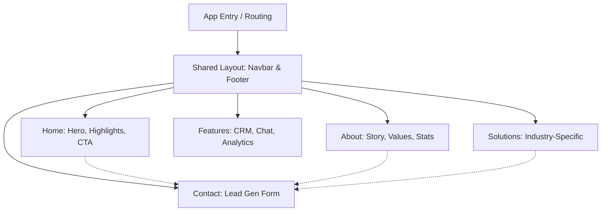

# SKMH Solutions (AI & CRM Automation)

A premium marketing and landing website for **SKMH Solutions**, an agency specializing in centralized CRM, intelligent communication hubs, and bespoke AI software development (voice agents, workflow automation, and machine learning). 

## 🎯 Purpose
To serve as the digital storefront for a modern tech agency. The site highlights the agency's capabilities, explains the value proposition (saving time and scaling via AI), and provides clear calls-to-action for prospective clients to book demos.

## 📸 Architecture & Pages



## ✨ Features
*   **Modern Design:** Glassmorphism cards, animated gradients, and floating elements using Framer Motion.
*   **Responsive Layout:** Fully optimized for mobile, tablet, and desktop viewing.
*   **Component Architecture:** Clean, modular React components for easy maintenance.
*   **Dynamic Navigation:** Active state highlighting and mobile-friendly hamburger menus.
*   **SEO Optimized:** Clean semantic HTML structure.

## 🛠️ Tech Stack
*   **Frontend:** React 18, TypeScript, Vite
*   **Styling:** Tailwind CSS v4, custom utility classes
*   **UI Components:** shadcn/ui, Radix UI primitives
*   **Animations:** Framer Motion
*   **Icons:** Lucide React

## ⚙️ Setup & Installation

### Prerequisites
*   Node.js (v18+)

### 1. Clone the repository
```bash
git clone https://github.com/12345Shahid/ai-business-solutions-hub.git
cd ai-business-solutions-hub
```

### 2. Install dependencies
```bash
npm install
```

### 3. Run the Development Server
```bash
npm run dev
```
Open `http://localhost:8080` in your browser.

---
*Created by [Shahid](https://github.com/12345Shahid)*
